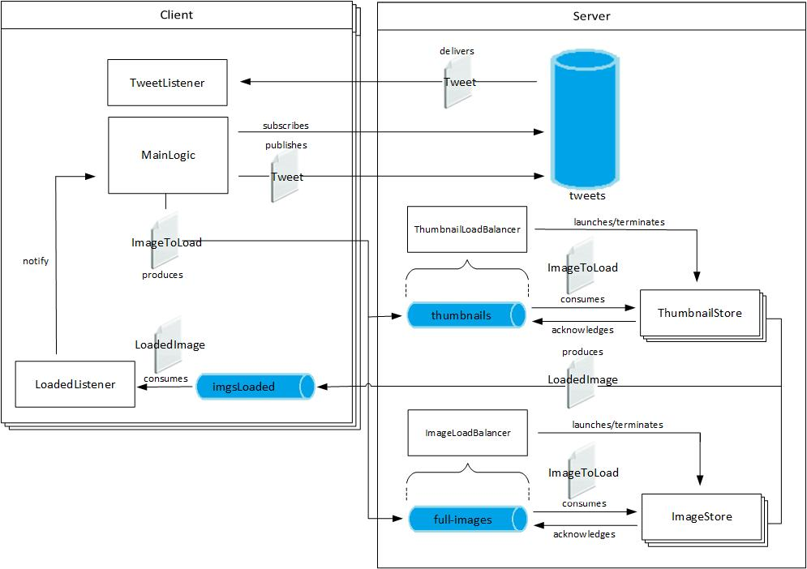

*This project was realized for the Politecnico di Milano course in Middleware Technologies for Distributed Systems*

# instatweet

A social networking application that uses JMS.

## Architecture

### Topic

- Tweet: topic used by clients to send tweets and subscribe to, durably, to receive messages sent when they were offline

### Queue

- thumbnails: queue used by the clients to send images to the thumbnail store service

- full-images: queue used by the clients to send images to the image store service

- imagesLoaded: temporary queue on the client to acknowledge the correct
upload of the images by the storage services

### Messages

ImageToLoad

- String username: used to store the image in the client personal folder
- int id: reflects client order of the images
- String extension
- byte[] img

LoadedImage

- int id: id of the loaded image, to guarantee that the order is preserved
- URL url: url to download the image
- boolean thumbnail: tells if the loaded image is a thumbnail

Tweet

- String text
- ArrayList\<URL> images
- ArrayList\<URL> thumbnails
